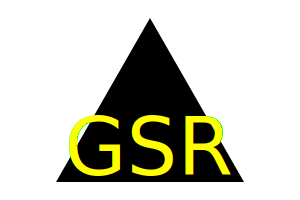

# SVG-Logo-Generator

## Table of Contents:
1. [Description](#description)
2. [Installation](#installation)
3. [Usage](#usage)
4. [Contributions](#contributions)
5. [Testing](#testing)
6. [License](#license)
7. [Technologies Used](#technology)
8. [Code Credit](#code-credit) 
9. [GitHub](#github)
10. [Email](#email)
  
  
## Description
This application allows the user to quickly create logos of various shapes and colors with their initials across the shape. It runs in the command line and generates a logo based on the user input.

## Installation
First ensure that NodeJs is insalled. Then clone the repository to your machine. Open the command prompt and navigate to the directory where the application is located. Then type 'npm install' in the command prompt to install the packages required to run the application. 

## Usage
In the command prompt type 'node index.js', then answer each question. The application will automatically generate a new logo based on your input.

## Contributions
Create a pull request or contact me through email or github.

## License
 

## Technologies Used
* [JavaScript](https://developer.mozilla.org/en-US/docs/Web/JavaScript)
* [NodeJS](https://nodejs.org/en)
* [Inquirer](https://www.npmjs.com/package/inquirer)
* [Jest](https://jestjs.io/)

## Code Credit
* To get the triangle, I used the example in the UC Berkley Coding bootcamp class materials.
* Big thank you to [daxburratto's guide to Validating a Hex Value](https://gist.github.com/daxburatto/307e8365c41fd5401f9ac315676490bf). I used this guide to validate the hexadecimal values with Regex.
## Questions
For qestions about the project you can contact me at

### Github
[gsr142](https://github.com/gsr142)

### Email
[gsr142@gmail.com](gsr142@gmail.com)